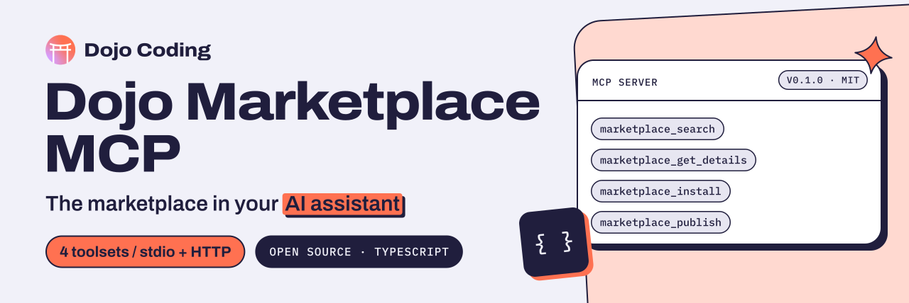

<p align="center">
  <a href="https://dojocoding.io">
    <picture>
      <source media="(prefers-color-scheme: dark)" srcset="docs/assets/banner-dark.svg">
      <source media="(prefers-color-scheme: light)" srcset="docs/assets/banner-light.svg">
      
    </picture>
  </a>
</p>

# Dojo Marketplace MCP

**An MCP server for builders who want to find, install and publish Dojo Marketplace skills, plugins and tools from their AI coding assistant.**

MCP server for the Dojo Marketplace. Browse, install, and publish marketplace items directly from AI coding assistants.

[](package.json) [](LICENSE) [](https://nodejs.org)

[Get started](#quick-start) · [Tools](#available-tools) · [Configuration](#configuration) · [Development](#development) · [Report an issue](https://github.com/DojoCodingLabs/dojo-marketplace-mcp/issues/new)

## Quick Start

```bash
npx -y @dojocoding/marketplace-mcp@latest
```

### Claude Desktop

Add to your `claude_desktop_config.json`:

```json
{
  "mcpServers": {
    "dojo-marketplace": {
      "command": "npx",
      "args": ["-y", "@dojocoding/marketplace-mcp@latest"],
      "env": {
        "DOJO_API_KEY": "your-api-key"
      }
    }
  }
}
```

## Configuration

| Variable | Default | Description |
|----------|---------|-------------|
| `DOJO_API_KEY` | — | API key (required) |
| `TRANSPORT_MODE` | `stdio` | `stdio` or `http` |
| `DOJO_TOOLSETS` | `browse,install` | Comma-separated enabled toolsets |
| `DOJO_API_BASE_URL` | `https://api.dojocoding.io` | Backend API URL |
| `MCP_PORT` | `3000` | Port for HTTP transport |
| `DOJO_LOG_LEVEL` | `info` | `debug`, `info`, `warn`, `error` |

## Available Tools

### browse (enabled by default)
- `marketplace_search` — Search items by query, category, or filters
- `marketplace_list_categories` — List all categories
- `marketplace_get_details` — Get item details
- `marketplace_get_reviews` — Get item reviews

### install (enabled by default)
- `marketplace_install` — Install an item
- `marketplace_uninstall` — Uninstall an item
- `marketplace_list_installed` — List installed items

### publish
- `marketplace_publish` — Publish a new item
- `marketplace_update_listing` — Update an existing listing
- `marketplace_deprecate` — Deprecate an item

### account
- `marketplace_get_profile` — Get your profile
- `marketplace_get_purchases` — List your purchases

Enable additional toolsets:

```bash
DOJO_TOOLSETS=browse,install,publish,account
```

## Development

```bash
npm install
npm run build
npm run dev          # watch mode
npm run start        # stdio mode
npm run start:http   # HTTP mode
```

## License

[MIT](LICENSE). Built by [Dojo Coding](https://dojocoding.io).

<p align="center">
  <a href="https://dojocoding.io"></a>
</p>
